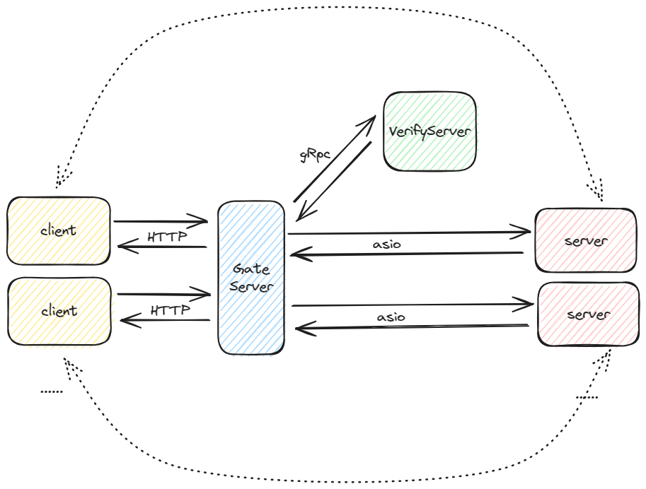

# yunyin_chat

​	一个全栈C++聊天项目。

## Run

### Front-End

​	本项目使用`cmake`构建：

```shell
# front-end
cmake -S . -B build -G "MinGW Makefiles" && cmake --build build
cd build && yunyin_chat.exe
```

* 本项目依赖[CMake](https://cmake.org/)
* 本项目依赖[QT](https://www.qt.io/zh-cn/)
  * 使用QtCreater编译
  * 或者安装Qt后配置环境变量：
    * C:\Qt\6.5.1\mingw_64\bin
    * C:\Qt\6.5.1\mingw_64\lib
    * C:\Qt\Tools\mingw1120_64\bin

### Gate-Server

​	gate-server depend on MSVC (temp now).

### Verify-Server 

​	varify-server depend on nodejs.

```shell
npm install @grpc/grpc-js
npm install uuid
npm install 
```


## Arch

* 客户端：前端使用QT，使用HTTP与网关通信
* 网关：转发请求到后端服务。使用gRpc与验证服务通信，使用asio与后端server通信
* 验证服务：使用Nodejs编写，调用第三方邮件接口
* 后台服务器：处理请求操作和数据



## Documents

​	本项目使用`doxygen`生成代码文档。

```shell
cd docs && doxygen
```

​	打开生成的`html/index.html`。